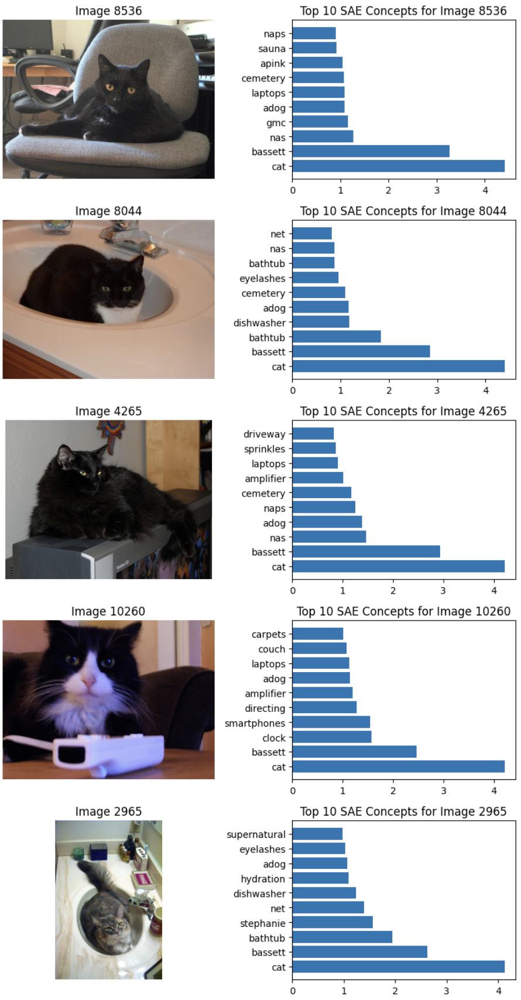

# Project for DLS: SAE for CLIP

## Описание задачи

В данном проекте мы попробуем интерпретировать активации мультимодальной модели CLIP с помощью обучения разряженного автоэнкодера. В качестве основы был взят TopK SAE. Эта архитектура является некоторым улучшением базового разряженного автоэнкодера. Ее особенностью является то, что она напрямую ограничивает число активных нейронов в скрытом слое, сохраняя только топ-K наибольших активаций и обнуляя все остальные. Для интерпретации результатов обучения рассмотрим латентное пространство полученного авоэнкодера, а также посмотрим, как работают модальности и попробуем сопоставить активным нейронам конкретные базовые концепты.

## Структура репозитория
* `src` - кастомная имплементация TopK SAE и пайпа для обучения
* `SAE_train_and_analysis.ipynb` - ноутбук с обучением и анализом результатов
* `SAE_train_and_analysis_no_widget.ipynb` - ноутбук с обучением и анализом результатов, то же самое что и выше, но убраны виджеты, чтобы отображалось сразу в github
* `project_report.pdf` - отчет о работе
* `README.md`

## Инструкция к запуску

Все обучение происходило в Colab. Для запуска нужно скачать соответствующий блокнот `SAE_train_and_analysis.ipynb` и запустить его. В секции с установкой библиотек и загрузкой компонент есть все нужное

Ссылка на веса модели (они также подгружаются в ноутбуке в секции с анализом результатов): https://drive.google.com/file/d/1UjcblgA3SrsBrIO9hAZ5ofMmsjKQx3Pi/view?usp=sharing

## Примеры работы 

### Изображения с одинаковым активным нейроном:

### Выделения компонент на изображениях 

### Поиск похожих изображений и выделение компонент

